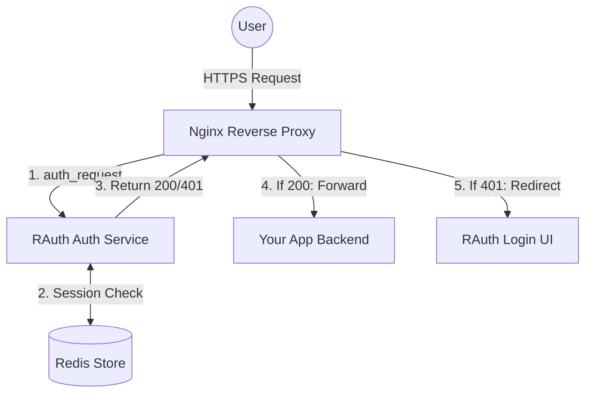

# RAuth: High-Performance Auth Proxy & Identity Management

<p align="center">
  
  
  
</p>

<p align="center">
  <a href="https://github.com/arumes31/rauth/actions/workflows/build.yml">
    
  </a>
  <a href="https://github.com/arumes31/rauth/actions/workflows/go-security.yml">
    
  </a>
</p>

---

RAuth is a lightweight, high-performance authentication proxy and user management system written in **Go**. It is specifically architected to provide a centralized, secure access control layer for self-hosted infrastructure via the Nginx `auth_request` module.

RAuth eliminates the complexity of full-scale identity providers while maintaining enterprise-grade security standards like **Passkey (WebAuthn)** support, **AES-256-GCM** session encryption, and real-time **Prometheus** observability.

## 📖 Table of Contents
- [🚀 Core Features](#-core-features)
- [🏗️ System Architecture](#-system-architecture)
- [🛡️ Security Architecture](#-security-architecture)
- [📦 Technical Stack](#-technical-stack)
- [🔧 Nginx Integration](#-nginx-integration)
- [📊 Monitoring & Observability](#-monitoring--observability)
- [⚙️ Configuration](#-configuration)
- [🚀 Deployment](#-deployment)
- [💻 Development](#-development)
- [❓ Troubleshooting FAQ](#-troubleshooting-faq)

---

## 🚀 Core Features

### 🔐 Multi-Factor Authentication (MFA)
*   **WebAuthn / Passkeys**: Modern, phishing-resistant authentication using hardware keys (YubiKey), TouchID, FaceID, or Windows Hello.
*   **User-Nameless Login**: Support for Discoverable Credentials (Resident Keys). Users can authenticate without typing a username; the server identifies them via their secure hardware key.
*   **TOTP Support**: Compatible with Google Authenticator, Authy, and Bitwarden.
*   **Enforced Setup**: New users are automatically guided through a secure MFA enrollment process.

> **Browser & Device Support**: Passkeys are supported on Chrome 67+, Edge 79+, Firefox 60+, and Safari 13+. Hardware keys (YubiKey) work across all platforms, while platform authenticators (TouchID, Windows Hello) require OS-level support.

### 🌐 Smart Session Management
*   **Sub-millisecond Validation**: Optimized Go backend with Redis caching for near-zero latency.
*   **Geo-Fencing**: Built-in MaxMind integration. If a session is accessed from a new country, it is instantly invalidated to prevent session hijacking.
*   **Device Awareness**: Logs and displays active sessions with User-Agent and IP metadata.
*   **System-Wide Invalidation**: Every password change or 2FA reset automatically terminates all other active sessions for that account.

### 🛠️ Administrative Control
*   **User Management**: Create, delete, and manage users via a secure dashboard.
*   **Credential Resets**: Force password changes or reset 2FA seeds for users.
*   **Audit Logging**: Every sensitive action (logins, failures, admin changes) is captured in a structured, searchable audit feed.
*   **Email Notifications**: Automated, security-themed HTML alerts for logins, password changes, 2FA modifications, and account creation.

### 🎨 Glassmorphism "Matrix" UI
RAuth features a modern, high-performance frontend built with Bootstrap 5 and custom CSS. 
*   **Visual Urgency**: Security-critical pages use a specialized red-themed urgency design.
*   **Glassmorphism**: Transparent, frosted-glass components with real-time backdrop filtering.
*   **Responsive**: Fully optimized for mobile, tablet, and desktop viewports.

---

## 🏗️ System Architecture

RAuth integrates seamlessly into your existing Nginx proxy stack using the `auth_request` module.



---

## 🛡️ Security Architecture

RAuth is built with a "Security-First" mindset:

1.  **Authenticated Encryption**: All session tokens stored in cookies are encrypted using **AES-256-GCM**.
2.  **At-Rest Secret Encryption**: User TOTP secrets are encrypted with the `SERVER_SECRET` before being stored in Redis, protecting against database exposure.
3.  **Enumeration Mitigation**: Uniform response times for login attempts via dummy password hashing, preventing username enumeration through timing attacks.
4.  **Brute-Force Protection**: Atomic Redis-backed rate limiting per IP and per username, covering both password and MFA/Passkey endpoints.
5.  **Hardened CSRF & CSP**: Strictly configured CSRF cookies (HTTPOnly, Secure, SameSite=Lax) and a robust Content Security Policy (CSP).
6.  **Clone Detection**: WebAuthn signature counter persistence allows the detection of cloned or tampered hardware security keys.
7.  **Hardened Redirects**: Built-in protection against Open Redirects, including protocol-relative URL bypasses.
8.  **Injection-Safe Emails**: All automated emails are hardened against Header (CRLF) Injection and HTML/XSS attacks.
9.  **Custom Error Interception**: Branded 404, 403, and 500 error pages prevent technical leakage and provide a unified UX.
10. **Background Hardening**: Automatic daily Geo-IP database updates and session cleanup tasks.

---

## 📦 Technical Stack

*   **Runtime**: [Go 1.24+](https://golang.org/) (High-concurrency, memory-safe)
*   **Web Framework**: [Echo v4](https://echo.labstack.com/)
*   **Identity Store**: [Redis 8.0+](https://redis.io/)
*   **MFA Core**: [go-webauthn](https://github.com/go-webauthn/webauthn) & [pquerna/otp](https://github.com/pquerna/otp)
*   **Geo-IP**: Native Go MMDB integration via [geoip2-golang](https://github.com/oschwald/geoip2-golang)
*   **Monitoring**: [Prometheus Client](https://github.com/prometheus/client_golang)
*   **Frontend**: Native Bootstrap 5 with a custom Glassmorphism "Matrix" theme.

---

## 🔧 Nginx Integration

RAuth acts as an "Authorizer" for Nginx. When a request hits your proxy, Nginx performs a lightweight subrequest to RAuth to verify the user's session.

### Example Nginx Snippet

```nginx
# 1. Define the RAuth validation endpoint
location = /rauth-verify {
    internal;
    proxy_pass http://rauth-auth-service/rauthvalidate;
    proxy_pass_request_body off;
    proxy_set_header Content-Length "";
    proxy_set_header X-Original-URI $request_uri;
    proxy_set_header X-Real-IP $remote_addr;
}

# 2. Protect your application
location / {
    auth_request /rauth-verify;
    
    # Propagate user identity to your backend
    auth_request_set $user $upstream_http_x_rauth_user;
    proxy_set_header X-User $user;

    # Handle unauthorized users
    error_page 401 = @error401;
    
    proxy_pass http://your-app-backend;
}

location @error401 {
    return 302 https://auth.yourdomain.com/rauthlogin?rd=$scheme://$http_host$request_uri;
}
```

### 🌐 Proxying Multiple Domains
RAuth can protect multiple apps across different subdomains using a single deployment. Set your `COOKIE_DOMAIN` to the root domain (e.g., `example.com`) to share session state between `app1.example.com` and `app2.example.com`.

---

## 📊 Monitoring & Observability

RAuth exposes real-time metrics in Prometheus format at `/metrics`. 

### Security & Usage Metrics
*   `rauth_login_success_total`: Cumulative count of successful logins.
*   `rauth_login_failed_total`: Cumulative count of failed attempts.
*   `rauth_active_sessions`: Gauge showing the current number of valid sessions in Redis.
*   `rauth_rate_limit_hits_total`: Count of requests blocked by the internal throttler.
*   `rauth_audit_logs_total`: Counter categorized by action (e.g., `USER_CHANGE_PASSWORD`, `ADMIN_DELETE_USER`).

### Access Control
By default, the `/metrics` endpoint is restricted to:
*   Localhost (`127.0.0.1`)
*   Private Subnets (`10.0.0.0/8`, etc.)
*   Tailscale IP ranges (`100.64.0.0/10`)

---

## ⚙️ Configuration

RAuth is configured via Environment Variables.

| Category | Variable | Description | Default |
|:---|:---|:---|:---|
| **Secret** | `SERVER_SECRET` | 32+ char key for AES encryption | **REQUIRED** |
| **Admin**  | `INITIAL_USER` | Initial admin username | `admin` |
| **Admin**  | `INITIAL_PASSWORD` | Initial admin password | (None) |
| **Admin**  | `INITIAL_EMAIL` | Initial admin email address | `admin@example.com` |
| **Admin**  | `INITIAL_2FA_SECRET` | Optional: Pre-set Base32 2FA secret | (None) |
| **Redis**  | `REDIS_HOST` | Hostname of the Redis instance | `rauth-auth-redis` |
| **Redis**  | `REDIS_PASSWORD` | Password for Redis auth | (None) |
| **Auth**   | `COOKIE_DOMAIN` | Domain for the auth cookie | `example.com` |
| **Auth**   | `TOKEN_VALIDITY_MINUTES`| Session duration in minutes | `2880` (2 days) |
| **Auth**   | `ALLOWED_HOSTS` | Redirect whitelist (Comma-separated) | `localhost,example.com` |
| **WebAuthn**| `WEBAUTHN_ORIGINS`| Allowed origins for Passkeys (Comma-separated)| (Auto-generated) |
| **URL**    | `PUBLIC_URL` | Base URL for email links (e.g., `https://auth.example.com`) | `http://localhost:5980` |
| **Network**| `AUTH_PORT` | Port to expose the auth service | `5980` |
| **Policy** | `PWD_MIN_LENGTH` | Minimum required password length | `8` |
| **Policy** | `PWD_REQUIRE_UPPER` | Require uppercase in passwords | `true` |
| **Policy** | `PWD_REQUIRE_LOWER` | Require lowercase in passwords | `true` |
| **Policy** | `PWD_REQUIRE_NUMBER` | Require numbers in passwords | `true` |
| **Policy** | `PWD_REQUIRE_SPECIAL`| Require special chars in passwords | `true` |
| **Security**| `METRICS_ALLOWED_IPS`| CIDR list for `/metrics` access | (Private + Tailscale) |
| **Geo-IP** | `MAXMIND_ACCOUNT_ID` | Your Account ID for Geo-IP updates | **REQUIRED** |
| **Geo-IP** | `MAXMIND_LICENSE_KEY` | Your License Key for Geo-IP updates | **REQUIRED** |
| **Geo-IP** | `GEOIP_EDITION_IDS` | Databases to download | `GeoLite2-Country` |
| **Email**  | `SMTP_HOST` | SMTP server hostname | (None) |
| **Email**  | `SMTP_PORT` | SMTP server port (e.g., 587) | (None) |
| **Email**  | `SMTP_USER` | SMTP username | (None) |
| **Email**  | `SMTP_PASS` | SMTP password | (None) |
| **Email**  | `SMTP_FROM` | Sender email address | (None) |
| **Regional**| `TZ` | Container Timezone (e.g., `Europe/Berlin`) | `UTC` |

---

## 🚀 Deployment

### 🗺️ Geo-IP Setup (Required)
RAuth requires a MaxMind GeoLite2 database for security features.
1.  Sign up for a free account at [MaxMind](https://www.maxmind.com/en/geolite2/signup).
2.  Generate a **License Key** from the account dashboard.
3.  Add `MAXMIND_ACCOUNT_ID` and `MAXMIND_LICENSE_KEY` to your `.env` file.
4.  RAuth will automatically download and update the database on startup.

### Quick Start with Docker Compose

1.  **Clone & Prepare**:
    ```bash
    git clone https://github.com/arumes31/rauth.git
    cd rauth
    cp example.env .env
    ```
2.  **Configure**: Edit `.env` and provide your `SERVER_SECRET` and MaxMind credentials.
3.  **Launch**:
    ```bash
    docker-compose up -d
    ```

RAuth will automatically initialize the primary admin user defined in your environment variables. Access the dashboard at `http://localhost:5980/rauthmgmt`.

---

## 💻 Development

### Prerequisites
*   Go 1.24+
*   Redis (or [miniredis](https://github.com/alicebob/miniredis) for testing)

### Testing
We use a combination of unit tests, integration tests, and fuzzing to ensure core security logic remains robust.
```bash
go test -v ./...
```

---

## ❓ Troubleshooting FAQ

**Q: Why am I stuck in a 401 Redirect Loop?**  
A: This usually happens when the `COOKIE_DOMAIN` in RAuth doesn't match the domain of the app you are protecting. Ensure the cookie can be shared across subdomains.

**Q: "Redis connection refused" in Docker?**  
A: Ensure RAuth and Redis are on the same Docker network. If using the default Compose file, use `REDIS_HOST=rauth-auth-redis`.

**Q: WebAuthn/Passkey registration fails?**  
A: WebAuthn requires HTTPS (or `localhost` for development). Ensure your Nginx proxy is serving over SSL and forwarding the correct `Host` headers.

---
Built with ❤️ for secure, fast, and private self-hosting.