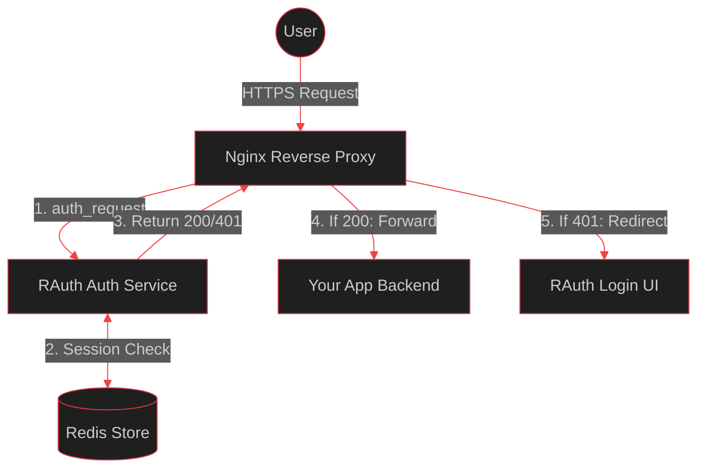

<p align="center">
  
</p>

<h1 align="center" style="border-bottom: none;"><span style="color: #ef4444;">RAuth</span>: High-Performance Auth Proxy & Identity Management</h1>

<p align="center">
  
  
  
</p>

<p align="center">
  
  
  
  
</p>

<p align="center">
  <a href="https://github.com/arumes31/rauth/actions/workflows/tests.yml">
    
  </a>
  <a href="https://github.com/arumes31/rauth/actions/workflows/build.yml">
    
  </a>
  <a href="https://github.com/arumes31/rauth/actions/workflows/go-security.yml">
    
  </a>
  <a href="https://github.com/arumes31/rauth/actions/workflows/security.yml">
    
  </a>
</p>

<p align="center">
  
  
  
</p>

---

RAuth is a lightweight, high-performance authentication proxy and user management system written in **Go**. It is specifically architected to provide a centralized, secure access control layer for self-hosted infrastructure via the Nginx `auth_request` module.

RAuth eliminates the complexity of full-scale identity providers while maintaining enterprise-grade security standards like **Passkey (WebAuthn)** support, **AES-256-GCM** session encryption, and real-time **Prometheus** observability.

## 📖 Table of Contents
- [🚀 Core Features](#-core-features)
- [🏗️ System Architecture](#-system-architecture)
- [🛡️ Security Architecture](#-security-architecture)
- [📦 Technical Stack](#-technical-stack)
- [🔧 Nginx Integration](#-nginx-integration)
- [📊 Monitoring & Observability](#-monitoring--observability)
- [📊 Screenshots](#-screenshots)
- [⚙️ Configuration](#-configuration)
- [🚀 Deployment](#-deployment)
- [💻 Development](#-development)
- [❓ Troubleshooting FAQ](#-troubleshooting-faq)

---

## 🚀 Core Features

<table width="100%">
  <tr>
    <td width="50%" valign="top">
      <h3>🔐 Multi-Factor Authentication</h3>
      <ul>
        <li><b>WebAuthn / Passkeys</b>: Modern, phishing-resistant authentication using YubiKeys, TouchID, FaceID, or Windows Hello.</li>
        <li><b>User-Nameless Login</b>: Discoverable Credentials support for logging in via hardware key without entering a username.</li>
        <li><b>TOTP Support</b>: Fully compatible with Google Authenticator, Authy, and Bitwarden.</li>
        <li><b>Enforced Setup</b>: Guided multi-factor enrollment automatically triggered for all new user sign-ins.</li>
      </ul>
    </td>
    <td width="50%" valign="top">
      <h3>🌐 Smart Session Management</h3>
      <ul>
        <li><b>Sub-millisecond Validation</b>: Near-zero latency Go backend cached on a high-speed Redis database.</li>
        <li><b>Geo-Fencing</b>: Real-time MaxMind integration instantly invalidating sessions initiated from anomalous countries.</li>
        <li><b>Device Awareness</b>: Rich user audits complete with browser, operating system, and IP location metadata.</li>
        <li><b>System-Wide Invalidation</b>: Automated termination of all active sessions on password changes or 2FA resets.</li>
      </ul>
    </td>
  </tr>
  <tr>
    <td width="50%" valign="top">
      <h3>🛠️ Administrative Control</h3>
      <ul>
        <li><b>User Dashboard</b>: Centralized user provisioning, deletion, and status auditing.</li>
        <li><b>Credential Resets</b>: Seamless forced password rotations and 2FA resets.</li>
        <li><b>Audit Logging</b>: Secure, structured, and searchable audit feed mapping critical authentication events.</li>
        <li><b>Security Emails</b>: HTML email alerts notifying users of new logins, resets, and credential changes.</li>
      </ul>
    </td>
    <td width="50%" valign="top">
      <h3>🎨 Glassmorphism "Matrix" UI</h3>
      <ul>
        <li><b>Visual Urgency</b>: Specialized high-intensity red styling for security-critical operations.</li>
        <li><b>Glassmorphic Layers</b>: Premium backdrop-filtered frosted-glass modules.</li>
        <li><b>Cyberpunk Styling</b>: Cyber-glowing iconography and responsive high-performance animations.</li>
        <li><b>Full Optimization</b>: Fully adaptive viewports designed for mobile, tablet, and desktop systems.</li>
      </ul>
    </td>
  </tr>
</table>

> [!NOTE]
> **Browser & Device Support**: Passkeys are supported on Chrome 67+, Edge 79+, Firefox 60+, and Safari 13+. Hardware keys (YubiKey) work across all platforms, while platform authenticators (TouchID, Windows Hello) require OS-level support.

---

## 🏗️ System Architecture

RAuth integrates seamlessly into your existing Nginx proxy stack using the `auth_request` module.


```mermaid
%%{init: {'theme': 'dark', 'themeVariables': { 'primaryColor': '#dc3545', 'primaryTextColor': '#fff', 'lineColor': '#ef4444', 'nodeBorder': '#dc3545', 'mainBkg': '#1f1f1f', 'actorBkg': '#1f1f1f' }}}%%
graph TD
    User((User)) -->|HTTPS Request| Nginx[Nginx Reverse Proxy]
    Nginx -->|1. auth_request| RAuth[RAuth Auth Service]
    RAuth <-->|2. Session Check| Redis[(Redis Store)]
    RAuth -->|3. Return 200/401| Nginx
    Nginx -->|4. If 200: Forward| Backend[Your App Backend]
    Nginx -->|5. If 401: Redirect| Login[RAuth Login UI]
```

---

## 🛡️ Security Architecture

RAuth is built with a "Security-First" mindset, implementing advanced system-wide hardening:

1.  **Authenticated Encryption**: All session tokens stored in cookies are encrypted using **AES-256-GCM**.
2.  **At-Rest Secret Encryption**: User TOTP secrets are encrypted with the `SERVER_SECRET` before being stored in Redis, protecting against database exposure.
3.  **Enumeration & Timing Attack Mitigation**: Uniform response times for login and session checks using fully valid, pre-computed 60-character dummy bcrypt hashes, completely neutralizing username enumeration timing attacks.
4.  **Brute-Force Protection & Rate Limiting**: Atomic Redis-backed rate limiting per IP and per username, protecting login pages, registration endpoints, and sensitive profile-level operations (e.g. 2FA verification, password change).
5.  **Hardened CSRF & CSP**: Strictly configured CSRF cookies (HTTPOnly, Secure, SameSite=Lax) and a robust Content Security Policy (CSP).
6.  **Clone Detection**: WebAuthn signature counter persistence allows the detection of cloned or tampered hardware security keys.
7.  **Hardened Redirects**: Built-in protection against Open Redirects, including protocol-relative URL bypasses.
8.  **Injection-Safe Emails**: All automated emails are hardened against Header (CRLF) Injection and HTML/XSS attacks.
9.  **Custom Error Interception**: Branded 404, 403, and 500 error pages prevent technical leakage and provide a unified UX.
10. **Background Hardening**: Automatic daily Geo-IP database updates and session cleanup tasks.

---

## 📦 Technical Stack

*   **Runtime**: [Go 1.26+](https://golang.org/) (High-concurrency, memory-safe)
*   **Web Framework**: [Echo v4](https://echo.labstack.com/)
*   **Identity Store**: [Redis 8.0+](https://redis.io/)
*   **MFA Core**: [go-webauthn](https://github.com/go-webauthn/webauthn) & [pquerna/otp](https://github.com/pquerna/otp)
*   **Geo-IP**: Native Go MMDB integration via [geoip2-golang](https://github.com/oschwald/geoip2-golang)
*   **Monitoring**: [Prometheus Client](https://github.com/prometheus/client_golang)
*   **Frontend**: Native Bootstrap 5 with a custom Glassmorphism "Matrix" theme.

---

## 🔧 Nginx Integration

RAuth acts as an "Authorizer" for Nginx. When a request hits your proxy, Nginx performs a lightweight subrequest to RAuth to verify the user's session.

### Example Nginx Snippet

```nginx
# 1. Define the RAuth validation endpoint
location = /rauth-verify {
    internal;
    proxy_pass http://rauth-auth-service/rauthvalidate;
    proxy_pass_request_body off;
    proxy_set_header Content-Length "";
    proxy_set_header X-Original-URI $request_uri;
    proxy_set_header X-Real-IP $remote_addr;
}

# 2. Protect your application
location / {
    auth_request /rauth-verify;
    
    # Propagate user identity to your backend
    auth_request_set $user $upstream_http_x_rauth_user;
    proxy_set_header X-User $user;

    # Handle unauthorized users
    error_page 401 = @error401;
    
    proxy_pass http://your-app-backend;
}

location @error401 {
    return 302 https://auth.yourdomain.com/rauthlogin?rd=$scheme://$http_host$request_uri;
}
```

### 🌐 Proxying Multiple Domains
RAuth can protect multiple apps across different subdomains using a single deployment. Set your `COOKIE_DOMAIN` to the root domain (e.g., `example.com`) to share session state between `app1.example.com` and `app2.example.com`.

---

## 📊 Monitoring & Observability

RAuth exposes real-time metrics in Prometheus format at `/metrics`. 

### Security & Usage Metrics
*   `rauth_login_success_total`: Cumulative count of successful logins.
*   `rauth_login_failed_total`: Cumulative count of failed attempts.
*   `rauth_active_sessions`: Gauge showing the current number of valid sessions in Redis.
*   `rauth_rate_limit_hits_total`: Count of requests blocked by the internal throttler.
*   `rauth_audit_logs_total`: Counter categorized by action (e.g., `USER_CHANGE_PASSWORD`, `ADMIN_DELETE_USER`).

### Access Control
By default, the `/metrics` endpoint is restricted to:
*   Localhost (`127.0.0.1`)
*   Private Subnets (`10.0.0.0/8`, etc.)
*   Tailscale IP ranges (`100.64.0.0/10`)

---

## 📊 Screenshots


---

## ⚙️ Configuration

RAuth is configured via Environment Variables.

<details>
  <summary>🔍 <b>View Configuration Options (Environment Variables)</b></summary>

| Category | Variable | Description | Default |
|:---|:---|:---|:---|
| **Secret** | `SERVER_SECRET` | 32+ char key for AES encryption | **REQUIRED** |
| **Admin**  | `INITIAL_USER` | Initial admin username | `admin` |
| **Admin**  | `INITIAL_PASSWORD` | Initial admin password | (None) |
| **Admin**  | `INITIAL_EMAIL` | Initial admin email address | `admin@example.com` |
| **Admin**  | `INITIAL_2FA_SECRET` | Optional: Pre-set Base32 2FA secret | (None) |
| **Redis**  | `REDIS_HOST` | Hostname of the Redis instance | `rauth-auth-redis` |
| **Redis**  | `REDIS_PORT` | Port of the Redis instance | `6379` |
| **Redis**  | `REDIS_PASSWORD` | Password for Redis auth | (None) |
| **Auth**   | `COOKIE_DOMAIN` | Domain for the auth cookie | `example.com` |
| **Auth**   | `ALLOWED_HOSTS` | Redirect whitelist (Comma-separated) | `localhost,127.0.0.1` |
| **Auth**   | `TOKEN_VALIDITY_MINUTES`| Session duration in minutes | `2880` (2 days) |
| **Auth**   | `ALLOWED_COUNTRIES` | List of allowed country codes (e.g. `US,DE`) | (Any) |
| **WebAuthn**| `WEBAUTHN_ORIGINS`| Allowed origins for Passkeys (Comma-separated)| (Auto-generated) |
| **URL**    | `PUBLIC_URL` | Base URL for email links (e.g., `https://auth.example.com`) | `http://localhost:5980` |
| **Network**| `AUTH_PORT` | Port to expose the auth service | `5980` |
| **Policy** | `PWD_MIN_LENGTH` | Minimum required password length | `8` |
| **Policy** | `PWD_REQUIRE_UPPER` | Require uppercase in passwords | `true` |
| **Policy** | `PWD_REQUIRE_LOWER` | Require lowercase in passwords | `true` |
| **Policy** | `PWD_REQUIRE_NUMBER` | Require numbers in passwords | `true` |
| **Policy** | `PWD_REQUIRE_SPECIAL`| Require special chars in passwords | `true` |
| **Security**| `METRICS_ALLOWED_IPS`| CIDR list for `/metrics` access | (Private + Tailscale) |
| **Geo-IP** | `MAXMIND_ACCOUNT_ID` | Your Account ID for Geo-IP updates | **REQUIRED** |
| **Geo-IP** | `MAXMIND_LICENSE_KEY` | Your License Key for Geo-IP updates | **REQUIRED** |
| **Geo-IP** | `GEOIP_EDITION_IDS` | Databases to download | `GeoLite2-Country` |
| **Geo-IP** | `MAXMIND_DB_PATH` | Path to local MaxMind .mmdb file | `/app/geoip/GeoLite2-Country.mmdb` |
| **Geo-IP** | `GEO_API_HOST` | Hostname of local Geo-IP service | `rauth-geo-service` |
| **Geo-IP** | `GEO_API_PORT` | Port of local Geo-IP service | `3000` |
| **Email**  | `SMTP_HOST` | SMTP server hostname | (None) |
| **Email**  | `SMTP_PORT` | SMTP server port (e.g., 587) | `587` |
| **Email**  | `SMTP_USER` | SMTP username | (None) |
| **Email**  | `SMTP_PASS` | SMTP password | (None) |
| **Email**  | `SMTP_FROM` | Sender email address | (None) |
| **Throttle**| `RATE_LIMIT_LOGIN_MAX`| Max authentication attempts per IP | `30` |
| **Throttle**| `RATE_LIMIT_LOGIN_DECAY`| Reset window for auth (seconds) | `300` |
| **Throttle**| `RATE_LIMIT_REG_MAX`| Max registrations per IP | `10` |
| **Throttle**| `RATE_LIMIT_REG_DECAY`| Reset window for reg (seconds) | `300` |
| **Throttle**| `RATE_LIMIT_VALIDATE_MAX`| Max validation attempts per IP | `1000` |
| **Throttle**| `RATE_LIMIT_VALIDATE_DECAY`| Reset window for validation (seconds) | `60` |
| **Throttle**| `RATE_LIMIT_LOGIN_ACCESS_MAX`| Max GET/POST requests to login per IP | `300` |
| **Throttle**| `RATE_LIMIT_LOGIN_ACCESS_DECAY`| Reset window for login access (seconds) | `60` |
| **Throttle**| `RATE_LIMIT_LOGIN_FAIL_USER_MAX`| Max fails per account before lockout | `10` |
| **Throttle**| `RATE_LIMIT_LOGIN_FAIL_USER_DECAY`| Account lockout duration (seconds) | `300` |
| **Throttle**| `RATE_LIMIT_LOGIN_FAIL_IP_MAX`| Max global IP failures before block | `50` |
| **Throttle**| `RATE_LIMIT_LOGIN_FAIL_IP_DECAY`| Global IP block duration (seconds) | `600` |
| **Regional**| `TZ` | Container Timezone (e.g., `Europe/Berlin`) | `UTC` |

</details>

---

## 🚀 Deployment

### 🗺️ Geo-IP Setup (Required)
RAuth requires a MaxMind GeoLite2 database for security features.
1.  Sign up for a free account at [MaxMind](https://www.maxmind.com/en/geolite2/signup).
2.  Generate a **License Key** from the account dashboard.
3.  Add `MAXMIND_ACCOUNT_ID` and `MAXMIND_LICENSE_KEY` to your `.env` file.
4.  RAuth will automatically download and update the database on startup.

### Quick Start with Docker Compose

1.  **Clone & Prepare**:
    ```bash
    git clone https://github.com/arumes31/rauth.git
    cd rauth
    cp example.env .env
    ```
2.  **Configure**: Edit `.env` and provide your `SERVER_SECRET` and MaxMind credentials.
3.  **Launch**:
    ```bash
    docker-compose up -d
    ```

RAuth will automatically initialize the primary admin user defined in your environment variables. Access the dashboard at `http://localhost:5980/rauthmgmt`.

---

## 💻 Development

### Prerequisites
*   Go 1.26+
*   Redis (or [miniredis](https://github.com/alicebob/miniredis) for testing)

### Testing
We use a combination of unit tests, integration tests, and fuzzing to ensure core security logic remains robust.
```bash
go test -v ./...
```

---

## ❓ Troubleshooting FAQ

<details>
  <summary>❓ <b>View Troubleshooting FAQ Solutions</b></summary>

### 🌐 Session & Cookie Routing
**Q: Why am I stuck in a 401 Redirect Loop?**  
A: This usually happens when the `COOKIE_DOMAIN` in RAuth doesn't match the domain of the application you are protecting. Ensure the cookie domain is set to a common root domain (e.g. `example.com`) to allow cookie sharing across subdomains (e.g. `app1.example.com` and `auth.example.com`).

**Q: Why is my session immediately invalidated when using a tablet or rotating my device?**  
A: Large tablets (like the Samsung Galaxy Tab series) default to requesting the "Desktop site" (spoofing a desktop Linux UA) but dynamically switch back to a mobile UA when rotated, resized in split-screen/pop-up views, or during background/Service-Worker requests. Using **User-Agent Client Hints (UA-CH)** under secure contexts (HTTPS) and the lenient browser-engine fallback for other browsers (like Safari/Firefox) and non-secure contexts reduce false invalidations but cannot eliminate them across all device mode, rotation, split-screen, or background/request context changes.

---

### 🔑 Passkeys & WebAuthn
**Q: WebAuthn/Passkey registration fails or gets rejected?**  
A: WebAuthn requires a secure origin (HTTPS or `localhost` for development). Ensure your Nginx proxy is serving over SSL and forwarding the correct host headers (`proxy_set_header Host $host;`). Additionally, check that `WEBAUTHN_ORIGINS` is configured with the exact origin scheme and port (e.g., `https://auth.example.com`).

**Q: How do I resolve signature counter/verification mismatches?**  
A: This can happen if the hardware key was cloned or the local state fell out of sync. For security reasons, RAuth detects this as a potential clone attack. Reset the user's WebAuthn key in the administrative dashboard to register the device afresh.

---

### 🛡️ Geo-IP & Blocking Policies
**Q: Why am I getting "403 Forbidden" geo-blocking errors for legitimate requests?**  
A: This happens if the user's IP address maps to an unlisted country, or the local MaxMind database is stale or missing. Verify that `MAXMIND_ACCOUNT_ID` and `MAXMIND_LICENSE_KEY` are correct, check container logs for geo-download status, or adjust the `ALLOWED_COUNTRIES` environment variable.

**Q: Why are active sessions not displaying the correct client IP addresses in the admin audits?**  
A: Nginx is likely not propagating the user's real IP address to the RAuth validation subrequest. Ensure your Nginx configuration passes `proxy_set_header X-Real-IP $remote_addr;` and `proxy_set_header X-Forwarded-For $proxy_add_x_forwarded_for;` to RAuth.

---

### ⚡ Infrastructure & Networking
**Q: Why are users experiencing "Rate Limit Exceeded" blockages during normal dashboard use?**  
A: The default session validation threshold might be too aggressive for heavy single-page apps making hundreds of concurrent resource subrequests. Increase `RATE_LIMIT_VALIDATE_MAX` (e.g. to `5000`) or adjust the decay window `RATE_LIMIT_VALIDATE_DECAY` to accommodate high-volume internal reverse-proxied traffic.

**Q: "Redis connection refused" in Docker?**  
A: Ensure RAuth and Redis are on the same Docker network. If using the default Compose file, use `REDIS_HOST=rauth-auth-redis`.

**Q: How do I resolve "SMTP connection timed out" or authentication errors for security emails?**  
A: Ensure RAuth's container can reach the SMTP host (check DNS and outbound firewall rules). Common ports are `587` (StartTLS) or `465` (SSL). Verify `SMTP_HOST`, `SMTP_PORT`, `SMTP_USER`, and `SMTP_PASS` are set correctly.

---

### 🔑 Recovery, Metrics, & Local Testing
**Q: How do I recover if the administrator loses their 2FA / TOTP key or gets locked out?**  
A: You can easily boot RAuth in a recovery mode. Set `INITIAL_USER`, `INITIAL_PASSWORD`, and `INITIAL_EMAIL` environment variables inside your `.env` file and restart the container. On startup, RAuth automatically verifies if the admin credentials are valid or updates them. Alternatively, if you have access to your Redis CLI, you can manually delete the admin's WebAuthn key using:
```bash
redis-cli DEL user:admin:webauthn_creds
```

**Q: Why is Prometheus unable to scrape metrics from the `/metrics` endpoint?**  
A: By default, RAuth restricts metrics access to localhost and private network CIDR blocks for security. If your Prometheus instance runs on an external network, add its IP address or subnet range to the `METRICS_ALLOWED_IPS` environment variable (e.g. `METRICS_ALLOWED_IPS=127.0.0.1,192.168.1.150`).

**Q: Why is the authentication cookie not saving when testing in local non-HTTPS development?**  
A: Modern browsers enforce the `Secure` attribute on cookies and block them over unencrypted HTTP links. However, browsers treat `localhost` and `127.0.0.1` as secure contexts even over plain HTTP. For local testing without SSL, ensure your browser URL points to `http://localhost:5980` instead of a custom local domain (e.g. `http://auth.local`) or configure an SSL reverse proxy.

</details>

</details>

---
Built with ❤️ for secure, fast, and private self-hosting.
